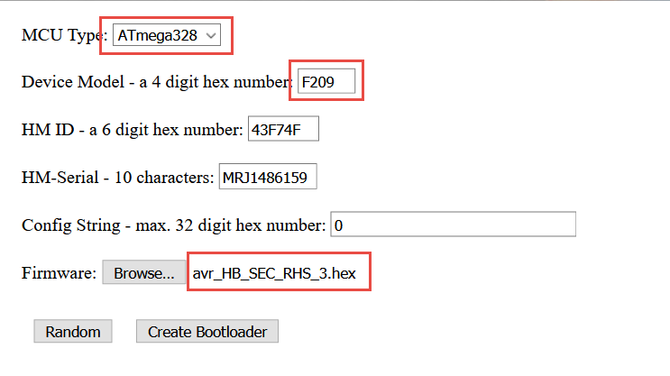

# Generate Firmware for HB-Sec-RHS-3

* download [AskSinPP](https://github.com/pa-pa/AskSinPP) 
* use bootloader/avr/make-ota.html to generate code to flash
* set values as shown in the image
  
* press "Create Bootloader" to generate bootloader together with firmware
* use bootloader/avr/flash.sh "SAVEDFILE.hex" to flash
* alternative use the following commands
```bash
avrdude -p m328p -P usb -c usbasp -B 10 -U lfuse:w:0xE2:m -U hfuse:w:0xD0:m -U efuse:w:0xFF:m -U lock:w:0xFF:m
avrdude -p m328p -P usb -c usbasp -V -U flash:w:SAVEDFILE.hex
```
